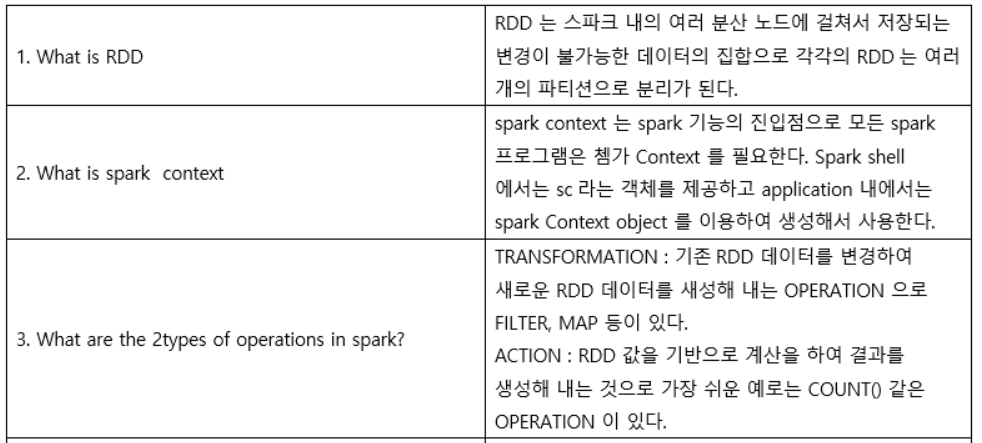
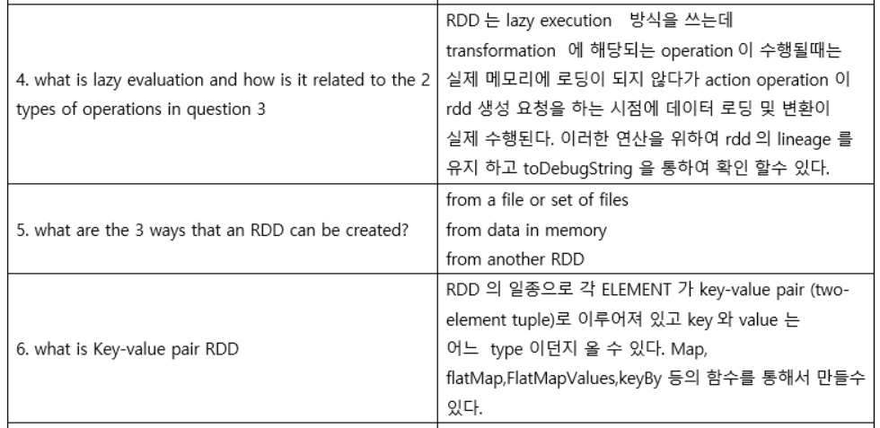
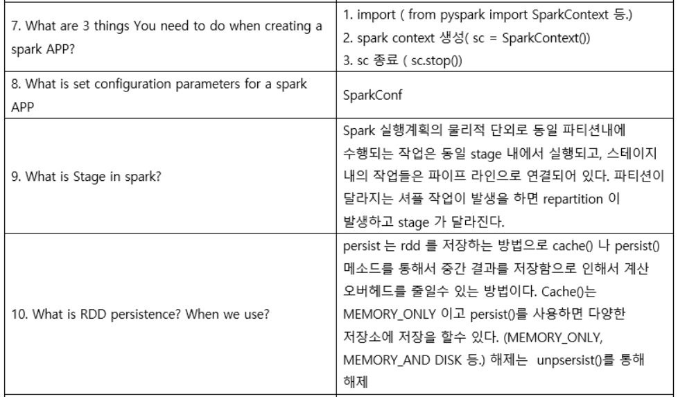
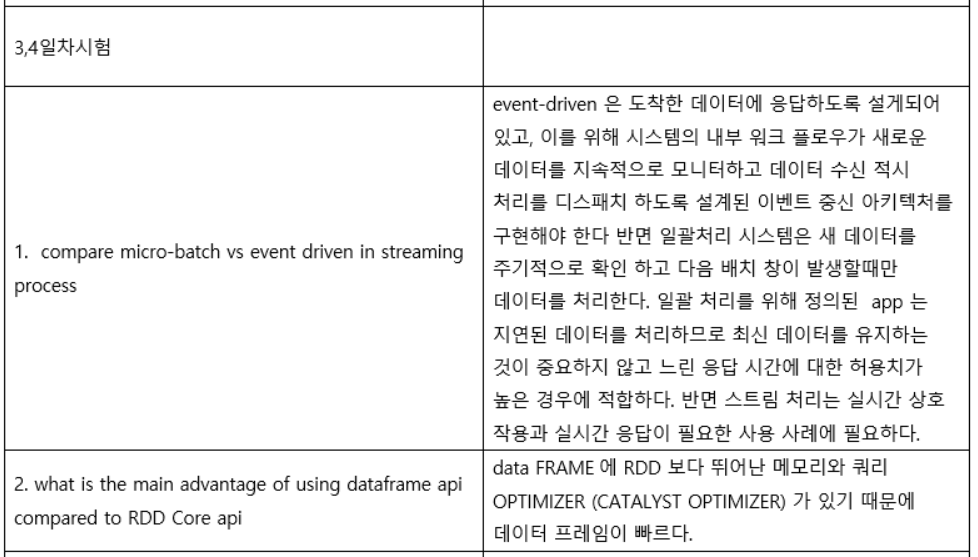
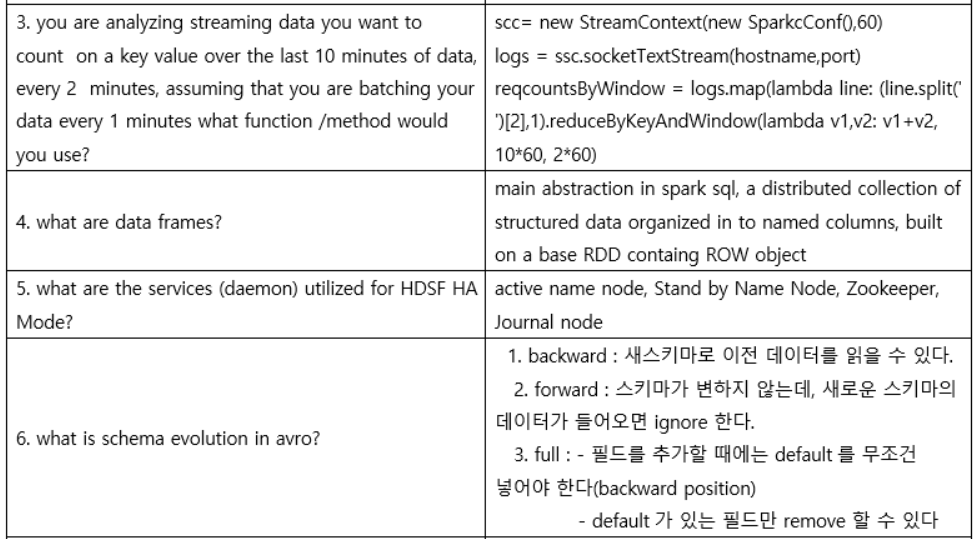
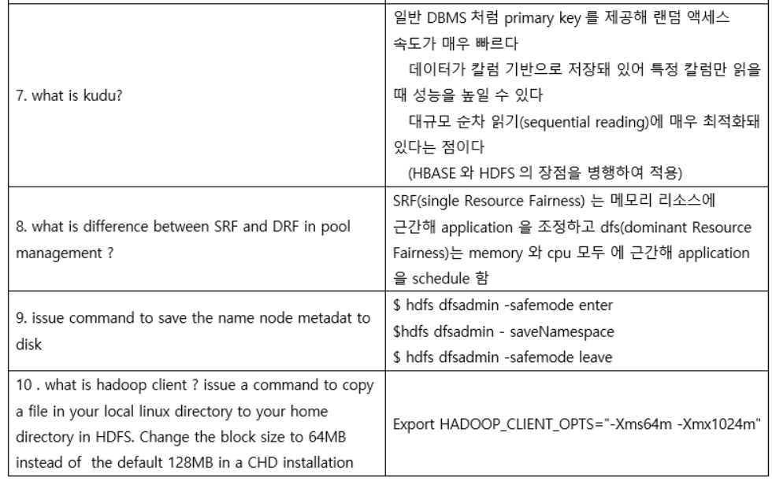

#### 1
1. To input a file into HDFS, the client application passes the data to the NameNode, which then dicvides the data into blocks and passes the blocks to the DataNodes (T/F)

2. What component (Master node) of HDFS is reponsible for maintaining the namespace of the distributed file system?

3. What is the default file replication factor in HDFS?

4. The NameNode maintains the namespace of the file system using which wto sets of files?

5. Which type of Hadoop cluster nodes provide resources for data processing?

6. Which service manages cluster CPU and memory resources?

7. How does a NameNode determine DataNode availability

8. What construct is granted CPU and memory resources?

9. What daemon/service is responsible for application fault tolerance?

10. By default, the various tasks for a single aplication / job will run on the same node if sufficient memory and CPU resources are available on that node (T/F)

11. Using hadoop's default settings, how much data will you be able to store on your Hadoop cluster if it has 12 nodes wigh 4TB of raw disk space per node allocated to HDFS storage?
() Approximately 3TB
() Approximately 12TB
() Approximately 16TB
() Approximately 48TB

12. Which two describe functions of the Nodemanager in YARN?
[] Tracking heartbeats from the Node Managers
[] Running a scheduler to determine how resources are allocated
[] Monitoring and reporting container status for map and reduce tasks
[] Archiving the job history information and meta-data
[] Negotiating cluster resouce containers from the scheduler, tracking container status, and monitoring job progress
[] Monitoring the status of the Application Master container and restarting on failure

13. You decide to create a cluster which runs HDFS in High Availability mode with automatic failover, using Quorum-based Storage. Which service keeps track of which nameNode is active at any given moment?
1) Zookeeper
2) Standby Namenode
3) Secondary Namenode
4) Quorum Journal manager
5) YARN ResourceManager
6) Individual JournalNode daemons

14. Identify the function performed by a secondary namenode daemon configured to run with a single Namenode
() It acts as a standby namenode, providing a high availability profile for clients.
() It performs realtime backups of the NameNode.
() It combines the fsimage and edits files produced by the NameNode
() It provides an alterante HDFS endpoint when the NameNode is too busy.

15. You have a cluster running 32 slave nodes and three master nodes, running MapReduce v1 (MRv1). You execute the command:
$hdfs fsck / (please execute this command in your terminal!!!)
which two of the following pieces of information will be returned to you?
[] the location of each block in the cluster
[] the number of Datanodes in the cluster
[] the number of nodes in each rack in the cluster
[] the numver of under-replicated blocks in the cluster
[] A list of all the files in the cluster
