# 2019-07-07 sansung.yoon 

## AWS EC2
~~~
https://supdev.tistory.com/22

private key(ppk,pem)를 이용하여 ssh접근하기
puttygen 이용하여 pem->ppk 변환
~~~

~~~
출처: https://zeddios.tistory.com/34 [ZeddiOS]
auth > browse 에서 ppk 파일 선택
putty 에서 ssh 로 접속
* ec2 redhat 접속 계정 : ec2-user

Amazon Linux의 경우 사용자 이름은 ec2-user입니다. 
RHEL의 경우 사용자 이름은 ec2-user 또는 root입니다. 
Ubuntu의 경우 사용자 이름은 ubuntu 또는 root입니다. 
Centos의 경우 사용자 이름은 centos입니다. 
Fedora의 경우 사용자 이름은 ec2-user입니다.
SUSE의 경우 사용자 이름은 ec2-user 또는 root입니다.
~~~

## Disable IPV6 
~~~
sudo sysctl -w net.ipv6.conf.all.disable_ipv6=1 
sudo sysctl -w net.ipv6.conf.default.disable_ipv6=1
~~~

## sudo vi /etc/hosts (all server)
~~~
hostnamectl set-hostname 'cm.com' 
hostnamectl set-hostname 'm1.com' 
hostnamectl set-hostname 'd1.com' 
hostnamectl set-hostname 'd2.com' 
hostnamectl set-hostname 'd3.com'
~~~
~~~
172.31.7.144    cm.com  cm 
172.31.7.241    m1.com  m1 
172.31.7.112    d1.com  d1 
172.31.3.217    d2.com  d2 
172.31.14.4     d3.com  d3
~~~

## Check hostname resolution (all server)
~~~
getent hosts cm.com 
getent hosts m1.com 
getent hosts d1.com 
getent hosts d2.com 
getent hosts d3.com
~~~

## reboot server (all server)
~~~
shutdown -r now
~~~

## Setup a password for centos (all server)
~~~
sudo passwd centos 
sudo vi /etc/ssh/sshd_config   
  change -> PasswordAuthentication yes 
  sudo systemctl restart sshd.service
~~~
.png)

## Configure repository (cm)
~~~
sudo yum install -y wget 
sudo wget https://archive.cloudera.com/cm5/redhat/7/x86_64/cm/cloudera-manager.repo -P /etc/yum.repos.d/ 
 
 
** change the baseurl within cloudera-manager https://archive.cloudera.com/cm5/redhat/7/x86_64/cm/5.15.2/ 
~~~
~~~
sudo rpm --import https://archive.cloudera.com/cm5/redhat/7/x86_64/cm/RPM-GPG-KEY-cloudera
~~~
~~~
sudo yum install -y cloudera-manager-daemons cloudera-manager-server
~~~
.png)
.png)

## Installing the JDK Using Cloudera Manager (all server)
~~~
sudo yum install -y oracle-j2sdk1.7
~~~
.png)
## Installing MariaDB Server (cm)
~~~
sudo yum install -y mariadb-server
~~~
.png)

## Configuring and Starting the MariaDB Server (cm)
~~~
sudo systemctl stop mariadb 
sudo vi /etc/my.cnf
~~~
~~~
sudo systemctl enable mariadb
sudo systemctl start mariadb
~~~

## Maria DB Password Setting (cm)
~~~
sudo /usr/bin/mysql_secure_installation
~~~
.png)

## Installing the MySQL JDBC Driver for MariaDB (all server)
install all node
~~~
sudo yum install -y wget 
sudo wget https://dev.mysql.com/get/Downloads/Connector-J/mysql-connector-java-5.1.46.tar.gz 
~~~
~~~
tar zxvf mysql-connector-java-5.1.46.tar.gz 
sudo mkdir -p /usr/share/java/ 
cd mysql-connector-java-5.1.46 
sudo cp mysql-connector-java-5.1.46-bin.jar /usr/share/java/mysql-connector-java.jar
~~~
.png)

## 계정 및 Database 생성
~~~
mysql -u root -p 
 
CREATE DATABASE scm DEFAULT CHARACTER SET utf8 DEFAULT COLLATE utf8_general_ci; 
GRANT ALL ON scm.* TO 'scm-user'@'%' IDENTIFIED BY 'somepassword'; 

CREATE DATABASE amon DEFAULT CHARACTER SET utf8 DEFAULT COLLATE utf8_general_ci; 
GRANT ALL ON amon.* TO 'amon-user'@'%' IDENTIFIED BY 'somepassword'; 
 
CREATE DATABASE rmon DEFAULT CHARACTER SET utf8 DEFAULT COLLATE utf8_general_ci; 
GRANT ALL ON rmon.* TO 'rmon-user'@'%' IDENTIFIED BY 'somepassword'; 
 
CREATE DATABASE hue DEFAULT CHARACTER SET utf8 DEFAULT COLLATE utf8_general_ci; 
GRANT ALL ON hue.* TO 'hue-user'@'%' IDENTIFIED BY 'somepassword'; 
 
CREATE DATABASE metastore DEFAULT CHARACTER SET utf8 DEFAULT COLLATE utf8_general_ci; 
GRANT ALL ON metastore.* TO 'metastore-user'@'%' IDENTIFIED BY 'somepassword'; 
 
CREATE DATABASE sentry DEFAULT CHARACTER SET utf8 DEFAULT COLLATE utf8_general_ci; 
GRANT ALL ON sentry.* TO 'sentry-user'@'%' IDENTIFIED BY 'somepassword'; 
 
CREATE DATABASE oozie DEFAULT CHARACTER SET utf8 DEFAULT COLLATE utf8_general_ci; 
GRANT ALL ON oozie.* TO 'oozie-user'@'%' IDENTIFIED BY 'somepassword'; 
 
FLUSH PRIVILEGES; 
SHOW DATABASES; 
EXIT;
~~~
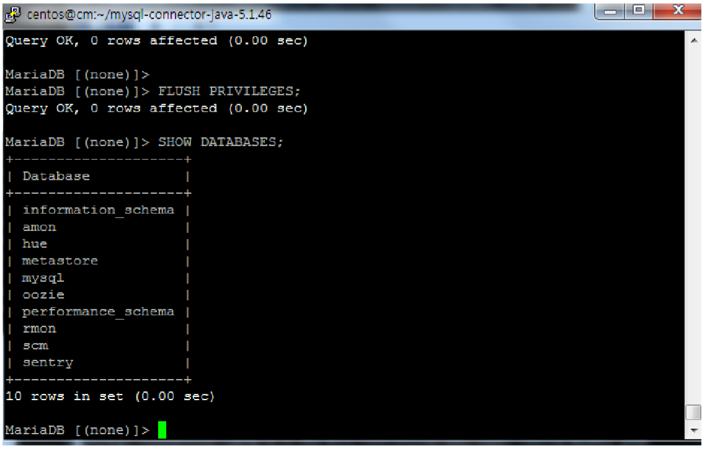

## Setup the CM database (cm)
~~~
sudo /usr/share/cmf/schema/scm_prepare_database.sh mysql scm scm-user somepassword 
sudo rm /etc/cloudera-scm-server/db.mgmt.properties 
sudo systemctl start cloudera-scm-server
~~~
## Connect CM
~~~
http://publicIp:7180
~~~

# 1
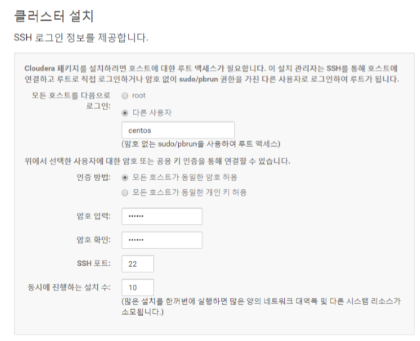
# 2
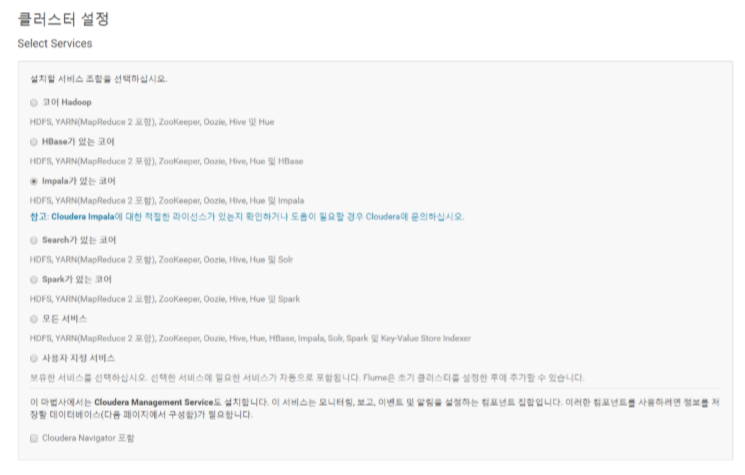
# 3
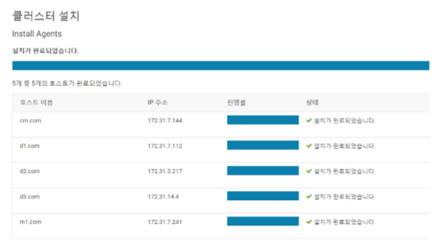
# 4
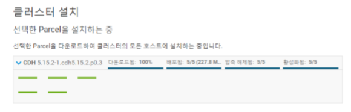
# 5
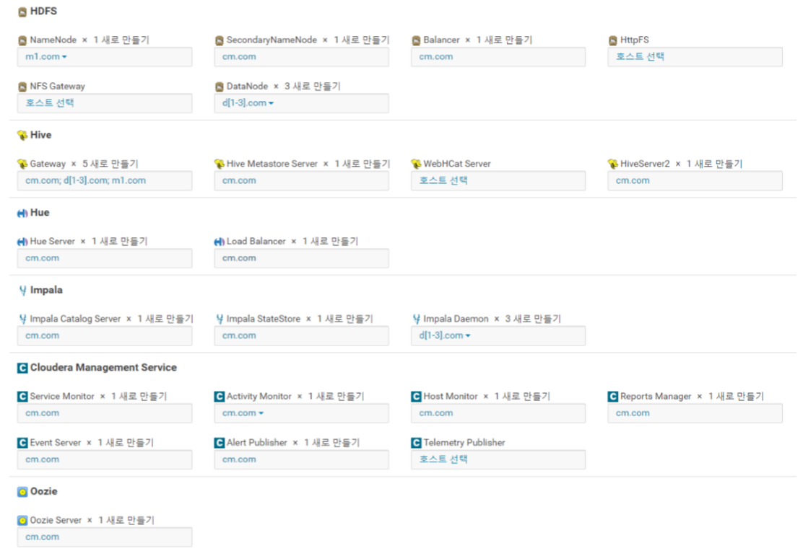
# 6
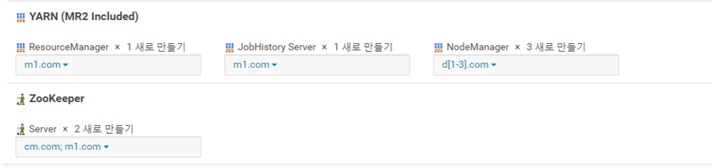
# 7
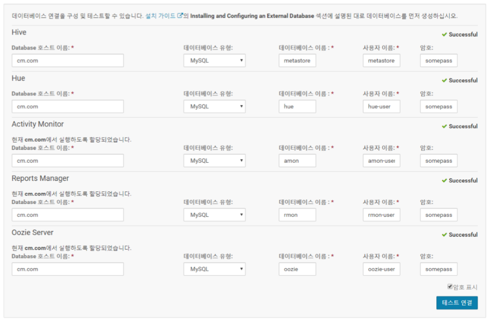
# 8
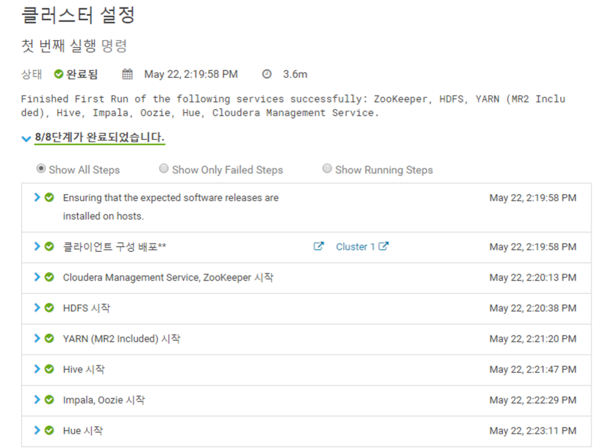

# TO DO

# Add Training User and wheel group (all server)
~~~
adduser training 
passwd training 
usermod -aG wheel training
~~~

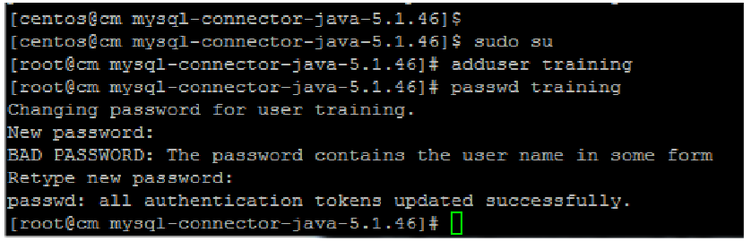

# Login Hue - Using web UI
~~~
training / training 으로 로그인
~~~
# 윈도우 파일 리눅스로 옮기기
~~~
CMD실행 후 파일이 존재하는 경로로 이동 다음 명령 실행 (CM과 D1에 작업)

pscp.exe authors.sql training@15.164.143.42:/home/training 
pscp.exe posts.sql training@15.164.143.42:/home/training
~~~

# 데이터베이스 생성
~~~
mysql -u root -p 
 
CREATE DATABASE test; 
SHOW DATABASES; 
EXIT;
~~~
# 테이블 생성
~~~
use test 
source posts.sql 
source authors.sql
~~~
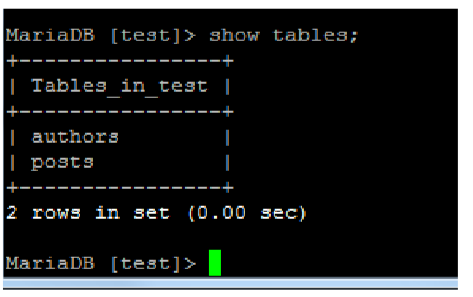
# db training user add (cm)
~~~
mysql -u root -p
GRANT ALL ON *.* TO 'training'@'%' IDENTIFIED BY 'training'; 
FLUSH PRIVILEGES; 
EXIT;
~~~
# Sqoop --> Hive
~~~
sqoop import \ 
--connect jdbc:mysql://cm/test \ 
--username training --password training \ 
--table posts \ 
--hive-import 
 
sqoop import \ 
--connect jdbc:mysql://cm/test \ 
--username training --password training \ 
--table authors \ 
--hive-import

~~~

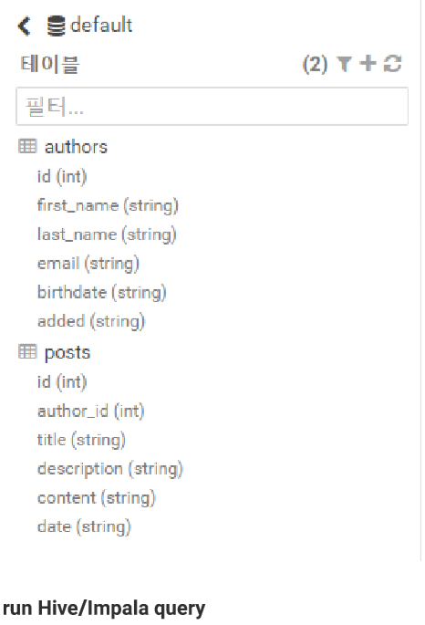

## End Of File

